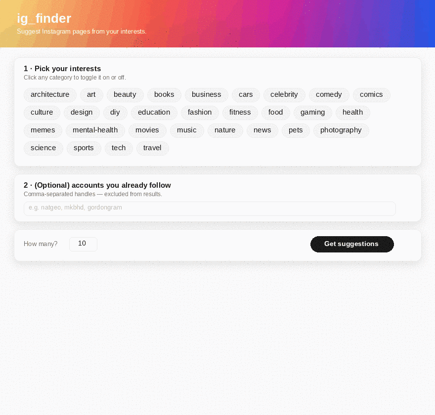

# ig_finder

> A small, hackable **hybrid content-based recommender** that suggests Instagram pages from a user's stated interests and the accounts they already follow.

<p align="center">
  
</p>

[](https://github.com/marrlourenco/ig_finder/actions/workflows/ci.yml)
[](https://www.python.org/)
[](https://fastapi.tiangolo.com/)
[](https://github.com/psf/black)
[](LICENSE)

---

`ig_finder` is a compact end-to-end project showcasing a recommender system: data modeling, a content-based ranking pipeline (TF-IDF + category overlap + popularity prior), a REST API, a web UI, tests, CI, and Docker — all in a single small repository.

## CLI demo

Pick a few interest categories, optionally drop in some Instagram handles you already follow, and the system returns ranked suggestions with explanations.

```
$ ig-finder -c photography -c nature -f natgeo -n 5

Rank Score   Handle                      Name
------------------------------------------------------------------------
1    0.825   @chrisburkard               Chris Burkard
     ·       Matches your interests: nature, photography.
2    0.812   @ourplanet                  Our Planet
     ·       Matches your interests: nature.
3    0.788   @bbcearth                   BBC Earth
     ·       Matches your interests: nature.
4    0.770   @natgeotravel               National Geographic Travel
     ·       Similar to pages you follow (shared categories: travel).
5    0.731   @earthpix                   Earth
     ·       Matches your interests: nature, photography.
```

## Architecture


The recommender blends three signals per candidate page:

| Signal | Weight | What it measures |
|---|---|---|
| **Category overlap** | 0.50 | Jaccard similarity between the user's chosen categories (plus categories inherited from followed accounts) and the candidate's categories. |
| **Content similarity** | 0.40 | TF-IDF cosine similarity between a query document (categories + inherited tags) and a bag-of-words representation of each candidate (categories ×2 + tags + description). |
| **Popularity prior** | 0.10 | Log-scaled follower count, used as a gentle tiebreaker so we don't surface ultra-obscure pages when nothing else differentiates. |

Followed accounts are excluded from the output, and every recommendation ships with **human-readable reasons** — explainability matters.

## Quick start

### Option A — local Python

```bash
git clone https://github.com/marrlourenco/ig_finder.git
cd ig_finder
python -m venv .venv && source .venv/bin/activate   # Windows: .venv\Scripts\activate
pip install -e ".[dev]"
uvicorn app.main:app --reload
```

Open <http://127.0.0.1:8000>.

### Option B — Docker

```bash
docker build -t ig-finder .
docker run -p 8000:8000 ig-finder
```

### Option C — CLI

```bash
ig-finder -c travel -c food -f natgeo -f gordongram -n 8
```

## API

Interactive docs at <http://127.0.0.1:8000/docs> once the server is running.

### `POST /api/recommend`

Request:

```json
{
  "categories": ["photography", "nature"],
  "following": ["natgeo", "chrisburkard"],
  "limit": 10
}
```

Response (truncated):

```json
{
  "count": 10,
  "recommendations": [
    {
      "page": {
        "username": "ourplanet",
        "name": "Our Planet",
        "categories": ["nature", "science"],
        "tags": ["wildlife", "documentary", "conservation", "earth"],
        "followers_millions": 1.3,
        "description": "Our Planet — Netflix nature documentary series."
      },
      "score": 0.812,
      "reasons": [
        "Matches your interests: nature.",
        "Shares tags with pages you follow: earth, wildlife."
      ]
    }
  ]
}
```

### Other endpoints

| Method | Path | Description |
|---|---|---|
| GET | `/api/health` | Service health and dataset size |
| GET | `/api/categories` | Every category present in the catalog |
| GET | `/api/pages` | The full catalog (handy for autocomplete) |
| GET | `/` | The bundled web UI |

## Project layout

```
ig_finder/
├── app/
│   ├── main.py          # FastAPI app + endpoints
│   ├── recommender.py   # Hybrid scoring core
│   ├── data_loader.py   # Loads data/pages.json
│   ├── models.py        # Pydantic models
│   ├── scraper.py       # Optional IG metadata scraper
│   └── cli.py           # `ig-finder` command-line wrapper
├── data/
│   └── pages.json       # ~100 curated Instagram accounts
├── static/              # Tiny vanilla-JS frontend
├── tests/               # pytest suite (recommender, API, models, loader)
├── .github/workflows/   # CI: ruff + black + pytest on 3.10–3.12
├── Dockerfile
├── pyproject.toml
└── README.md
```

## Extending the dataset

`data/pages.json` is just an array of records:

```json
{
  "username": "your_handle",
  "name": "Display Name",
  "categories": ["tech", "education"],
  "tags": ["ai", "machine-learning"],
  "followers_millions": 1.2,
  "description": "Short blurb."
}
```

Drop new entries in by hand, or experiment with the optional scraper:

```bash
pip install -e ".[scraping]"
python -c "from app.scraper import extend_dataset; extend_dataset(['nasa', 'spacex'], output_path='data/pages.json')"
```

⚠️ Instagram's terms of service forbid most automated scraping, and unauthenticated requests are aggressively rate-limited. The scraper exists to demonstrate the extension point — production use should rely on the official Graph API or a paid third-party provider.

## Development

```bash
pip install -e ".[dev]"

ruff check .         # lint
black --check .      # format check
pytest               # run tests
pytest --cov=app     # with coverage
```

CI runs all three on Python 3.10, 3.11 and 3.12.

## Design notes & trade-offs

* **Why content-based and not collaborative filtering?** A real CF system would need user–follow interaction data. Building a synthetic one for a portfolio project is more theater than substance; a transparent content-based recommender with explicit, *explainable* features is more honest about what's going on.
* **Why TF-IDF?** It's a strong, well-understood baseline for short documents (categories + tags + a 1-sentence bio). The recommender is small enough that the entire matrix fits in memory; for catalog sizes > ~100k pages I'd swap in approximate nearest neighbors (e.g. `faiss` or `hnswlib`).
* **Why repeat categories in the bag-of-words?** Duplicating the category tokens (`*= 2`) gives them slightly more weight in the TF-IDF representation without hand-tuning IDF — a cheap, debuggable trick.
* **Cold start**: when the user gives no signal at all, the system falls back to a popularity ranking and clearly says so in the reason field. Better to be honest than to fake personalization.

## License

[MIT](LICENSE) — feel free to fork it, learn from it, ship something better.
